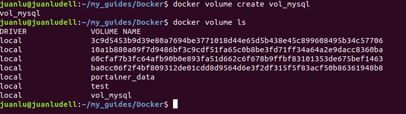
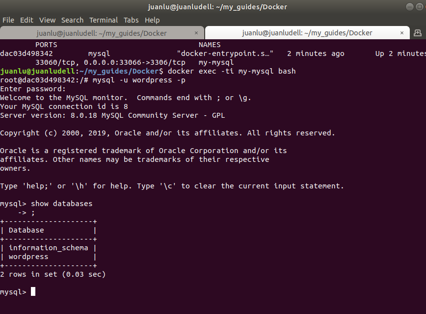
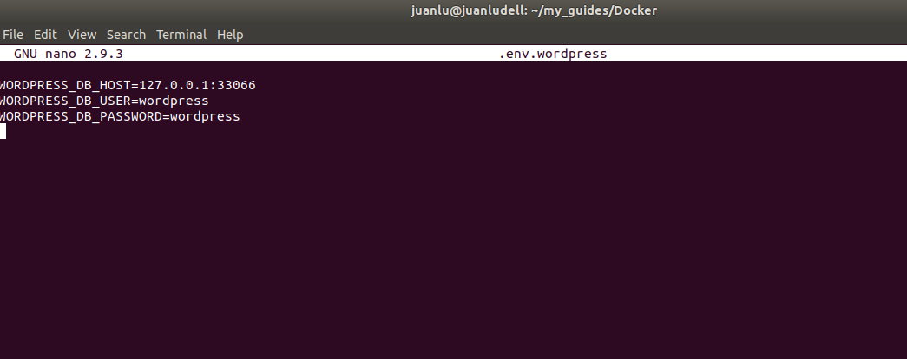
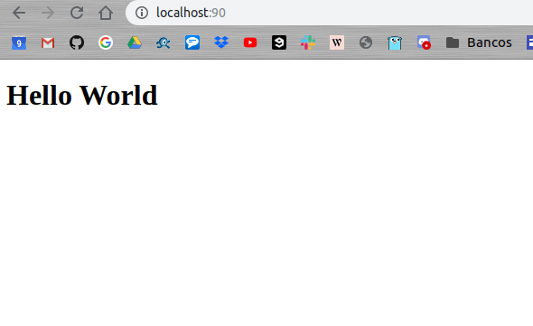
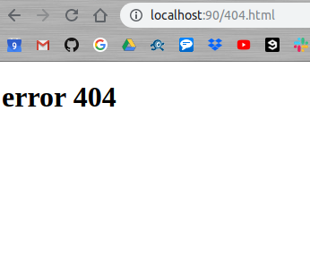

### Crear un contenedor MYSQL pasando variables de entorno

[BACK](../README.md)

Para poder crear el conenedor necesitamos tener descargala la IMAGEN de mysql. Para ello usaremos el siguiente comando

    docker pull mysql

Como vamos a necesitar la siguiente variables de entorno, vamos a preparar un .env.
> Igualmente podemos pasar la variable en el mismo comando run, pero al ser tantas mejor usar esta forma

```
MYSQL_ROOT_PASSWORD=12345678
MYSQL_DATABASE=wordpress
MYSQL_USER=wordpress
MYSQL_PASSWORD=wordpress
```

Metodo en linea: 

    docker run -e MYSQL_ROOT_PASSWORD=12345678 -3 OTHER_VARIABLE=ejemplo mysql

Metodo en archivo:

Creamos un archivo con el nombre que queramos, en mi caso sera .env


posteriormente lo insertaremos con --env-file [ruta]

Ahora, necesitamos crear una red, para luego poder conectar otros contenedores y que despues asociaremos a nuestro contenedor

Usaremos el comando:

    docker network create my_net



El siguiente paso será crear un volumen que tambien podremos incluir en nuestro contenedor para poder asociarlo a otros contenedores posteriormente. Y lo haremos de la siguiente manera:

    docker volume create vol_mysql


Para finalizar, prepararemos la linea de comando que lanzara el contendor con todas las especificaciones definidas anteriormente en una sola linea. Añadiendo que el puerto de salida sera el 3306 (en mi ejemplo por conflictos uso el 33066)

    docker run -d -p 3306:3306 --env-file ./.env --network=my_net -v vol_mysql:/var/lib/mysql --name my-mysql mysql 


Ahora vamos a verificar que el contendor funciona correctamente y que se han insertado bien las variables de entorno.




### Crear un contenedor Wordpress

Este ejercicio es muy parecido al anterior, pero vamos a detallar los pasos:

    docker pull bitnami/wordpress

En este caso no descargaremos con pull la imagen de wordpress, porque el comando RUN lo hace por nosotros en caso de que no este en local. En el ejemplo anterior habria funcionado igual.

Empezamos.

Primero prepararemos nuestro .env.wordpress con las siguientes variables de entorno

```
WORDPRESS_DB_HOST=127.0.0.1:33066
WORDPRESS_DB_USER=wordpress
WORDPRESS_DB_PASSWORD=wordpress
```

    sudo nano .env.wordpress
    


Creamos el volumen para este contenedor

    docker volume create vol_wordpress
    

Y como la red que vamos a gastar es la misma, para que los dos contenedores que estamos creando se puedas ver. El comando RUN será el siguiente

    docker run -d -p 8080:80 --env-file ./.env.wordpress --network=my_net -v vol_wordpress:/var/www/html --name my_wordpress bitnami/wordpress


###Crear, por medio de un dockerfile, una imagen basada en una de Ubuntu con Apache

Necesitamos primero de todo, instalar apache asi que el Dockerfile empezará asi:

    FROM ubuntu
    
    RUN apt-get update && apt-get install apache2 -y
    
Ahora necesitaremos pasar un fichero de configuración.

Primero vamos a crearlo

    <VirtualHost *:80>
        ServerAdmin webmaster@localhost
        DocumentRoot /var/www/ejercicio
    
        ErrorDocument 404 /var/www/ejercicio/404.html
        ErrorLog ${APACHE_LOG_DIR}/error.log
        CustomLog ${APACHE_LOG_DIR}/access.log combined
    
    <VirtualHost>
    
Lo guardaremos como ejercicio.conf y en el Dockerfile añadiremos la siguiente linea

    COPY ejercicio.conf /etc/apache2/sites-availables/000-default.conf

Esto guardara el contenido del ejericio.conf en 000-default.conf

Ahora compiaremos dos htmls de index y de 404 que crearemos con un simple h1 como ejemplo y añadiremos la siguiente linea al Dockerfil

    COPY ["index.html", "404.html", "/var/www/html/"]

Bien, por ultimo exponeos el puerto 80 y añadimos el CMD, ejemplo:

    EXPOSE 80
    CMD apachectl -D FOREGROUND

Con el FOREGROUND conseguimos que el servicio de apache no se quede cerrado.

Usaremos docker build . 

    docker image build -t test_apache .

El  cogera el Dockerfile y creara la imagen con el build y el -t le asignara un nombre

    docker run -p 90:80 -v ~/ejercicio_logs/:/var/log/apache2/ --name=test_apache test_apache

Usaremos el docker run siguiente para montar el contenedor






