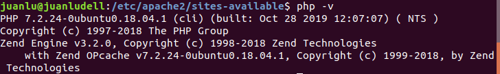
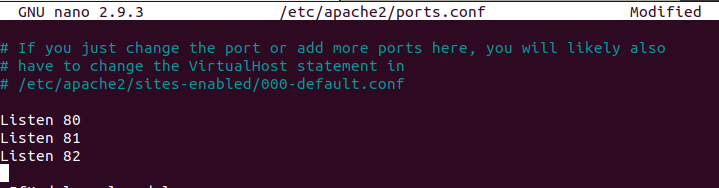
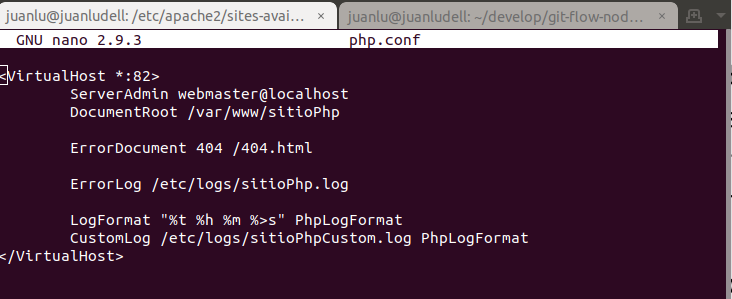
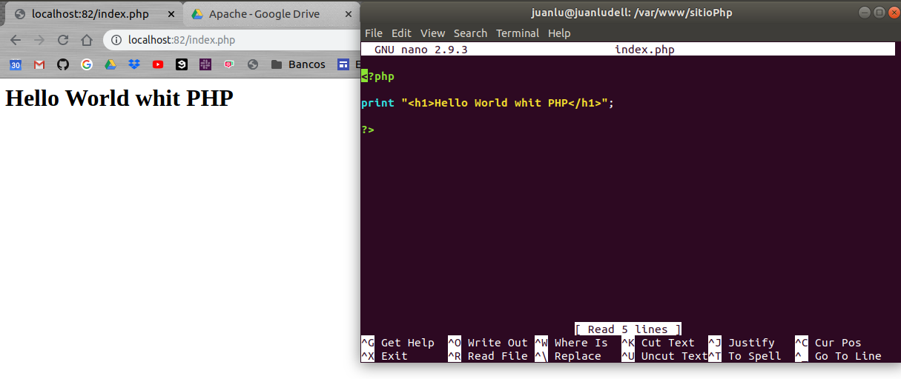
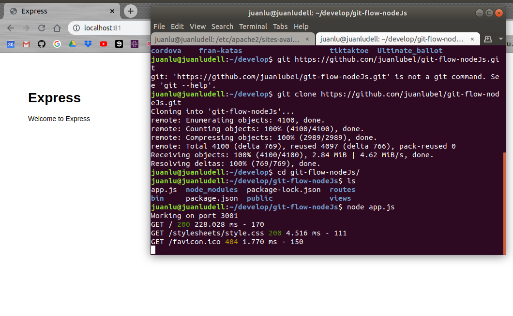

# Servidor apache

[BACK](../README.md)

[ejemplo usado en la guia del servidor NodeJs](https://github.com/juanlubel/git-flow-nodeJs)

## Configurar un servidor PHP

Installamos PHP y lo habilitamos en apache

    sudo apt intall php
    php -v 
    


    a2enmod php7.2

Habilitamos el puerto 82



Y configuramos y habilitamos etc/apache2/sites-availables/php.conf



    sudo a2ensite php.conf
    sudo service apache2 reload

Y accedemos a la ruta localhost:82




## Configurar Apache proxy para un servidor NodeJs

Primero necesitamos activar de la siguiente manera dos módulos.

    a2enmod proxy
    a2enmod proxy_http

Luego creamos en sites-available un documento .conf en el que tendremos la siguiente configuración

```
<VirtualHost *:81>
        ServerAdmin webmaster@localhost
        DocumentRoot /var/www/sitioNode

        ProxyRequests off
        ProxyPass / http://127.0.0.1:3001/
        ProxyPassReverse / http://127.0.0.1:3001/
</VirtualHost>
```

Al acceder a la ruta localhost:81 accederemos al servidor creado por Node




