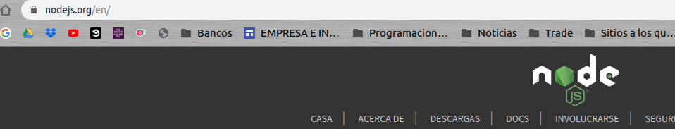

# Servidor apache

[BACK](../README.md)

[ejemplo usado en la guia del servidor NodeJs](https://github.com/juanlubel/git-flow-nodeJs)

## Configurar un servidor PHP

Installamos PHP y lo habilitamos en apache

    sudo apt intall php
    php -v 
    


    a2enmod php7.2

Habilitamos el puerto 82


Y configuramos y habilitamos etc/apache2/sites-availables/php.conf


    sudo a2ensite php.conf
    sudo service apache2 reload

Y accedemos a la ruta localhost:82


## Configurar Apache proxy para un servidor NodeJs

Primero necesitamos activar de la siguiente manera dos módulos.

    a2enmod proxy
    a2enmod proxy_http

Luego creamos en sites-available un documento .conf en el que tendremos la siguiente configuración

```
<VirtualHost *:81>
        ServerAdmin webmaster@localhost
        DocumentRoot /var/www/sitioNode

        ProxyRequests off
        ProxyPass / http://127.0.0.1:3001/
        ProxyPassReverse / http://127.0.0.1:3001/
</VirtualHost>
```

Al acceder a la ruta localhost:81 accederemos al servidor creado por Node


Configuramos el Custom log, añadiendo al documento anterior la siguiente linea

    CustomLog /etc/logs/sitioNode
    
###Directorio con acceso restringido

Primero tenemos que configurar el .conf de apache, para poder utilizar nuestro .htacces

Tambien necesitaremos el paquete apache2-utils, asgurate de tenerlos instalado

    sudo apt-get install apache2-utils

En /etc/apache2/apache2.conf, nos aseguramos de tener esta directiva

```
<Directory /var/www/sitioNode/public_files>
        AllowOverride All
</Directory>
```

Ahora necesitaremos crear un usuario que tendrá acceso con la siguiente linea

> juanlu : es mi ejemplo de usuario. Utiliza el usuario que mas te convenga 

    sudo htpasswd -c /etc/apache2/.htpasswd juanlu
    


como veras en la siguiente imagen es ese momento debes introducir la contraseña dos veces.

Ahora crearemos el directorio public_files en la carpeta y el fichero .htaccess

    touch /var/www/sitioNode/public_files/.htaccess
    
Luego añadimos la siguiente directiva en el .htaccess

    AuthUserFile "/etc/apache2/.htpasswd"
    AuthType Basic
    Require valid-user
    
Y para que el proxy coja la ruta del puerto original y no del servidor de node añadimos en sitioNode.conf

    <Location /public_files >
            ProxyPass !
    </Location>
    


Vamos a realizar un redirect

Añadimos en sitioNode.conf la siguiente linea

    Redirect /documentation https://nodejs.org/en/
    
En el momento de acceder a la ruta redirige diretamente, pero si volver a acceder a la ruta sin presionar enter veremos esto


Cuando lo pulsemos, veremos que accede a la ruta designada




