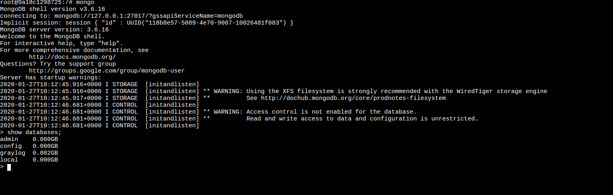

# Práctica Docker Compose

[BACK](../README.md)

## ElasticSearch

Nombre del servicio:

Aquí definimos el nombre del servicio, y le indicamos desde que imagen debe crear el contenedor.

```
version: '3'
services:

 elasticsearch:
   image: docker.elastic.co/elasticsearch/elasticsearch-oss:6.8.2
 ...
```

Variables de entorno:

con la etiqueta "environment", podremos añadir todas las variables que queremos que se creen por defecto dentro del contenedor
para la instalación de cualquier servicio, en este caso ElasticSearch

```
version: '3'
services:

 elasticsearch:
 ...
   environment:
     - http.host=0.0.0.0
     - transport.host=0.0.0.0 #localhost
     - network.host=0.0.0.0
     - "ES_JAVA_OPTS=-Xms512m -Xmx512m"
 ...
```

Volumen:

Para insertar un volumen, deberemos hacer dos cosas. Primero (aunque por convención se colocara al final del docker-compose)
, indicaremos con la etiqueta volumes al mismo nivel que la etiqueta services, que cree un volumen llamado en
este caso "elastik"

Después, con la misma etiqueta (importante colocar bien la indentación), dentro de servicio a misma altura que el resto
de requisitos para configurar el contenedor. Indicaremos qué volumen estará asociado a que directorio del contendor de la siguiente forma

   volume_name:path/to/link

> Nótese los dos puntos ":". En este caso no deben de haber separación entre los dos parámetros.

```
version: '3'
services:

 elasticsearch:
 ...
   volumes:
     - elastik:/usr/share/elasticsearch/data
 ...


volumes:
 ...
 elastik:
 ...
```

Network:

Ahora haremos algo similar como los volúmenes pero con una network.
Esto nos servirá para configurar todos los contenedores que queramos en una misma red, o varias si fuera necesario.

```
version: '3'
services:

 elasticsearch:
 ...
   networks:
     - practica_network
 ...


networks:
 practica_network:
```

Healthcheck:

Este parámetro realizar una comprobación cada x segundos, para comprobar si el servicio
funciona correctamente. Mientras la respuesta sea 200, todo va bien.

En este ejemplo realizara 5 peticiones, una cada 30 segundos con una espera de 10 segundos en caso de fallo.

```
version: '3'
services:

 elasticsearch:
 ...
   healthcheck:
     test: ["curl", "-f", "https://localhost:9200"]
     interval: 30s
     timeout: 10s
     retries: 5
 ...
```


Ulimits:

Lo usaremos para establecer límites que sólo se apliquen en este contenedor.
En este caso limitaremos el uso de la memoria ram.

```
version: '3'
services:

 elasticsearch:
 ...
   ulimits:
     memlock:
       soft: -1
       hard: -1
 ...
```


## Mongo

Vamos a realizar unos pasos similares al ejercicio anterior.

El parámetro que hemos añadido es la exposición del puerto 27017 para que se pueda acceder
desde fuera del contenedor

En este caso indicaremos también con los dos puntos ":", sin separaciones. Primero el puerto público seguido del puerto al que debe acceder en el contenedor.

También tenemos un volumen llamado "mongo", que se habrá definido bajo de la misma manera que antes.

El nombre y la imagen usada.

Un healthcheck, con una configuración ligeramente diferente, pero que nos aporta el mismo resultado.

Por último, usamos la misma network del servicio anterior. Que adelanto ya que será la misma para todos los servicios que veremos en el docker-compose

```
version: '3'
services:

 ...
 mongo:
   image: mongo:3
   volumes:
     - mongo:/data/db
   ports:
     - "27017:27017"
   healthcheck:
     test:
       - CMD
       - mongo
       - --eval
       - "db.adminCommand('ping')"
     interval: 30s
     timeout: 10s
     retries: 5
   networks:
     - practica_network
 ...
```



## Graylog

Aquí podemos observar unos parámetros nuevos.

restart:
Este parámetro nos define cuando debe reiniciarse el contendor. En este caso lo hemos configurado con "on-failure",
para que se reinicie si ocurre algún error en alguna peticion durante el uso del mismo

depends_on:
Con este parámetro configuramos que otros contenedores podrá acceder. Esto nos permite llamar al contenedor por su nombre
y no por la ruta pública. De esta manera también evitamos exponer contendores innecesariamente.

> La comodidad de llamar al contendor por su nombre en lugar de usar localhost  "mongo:27017 == localhost:27017"

En ports, podemos ver que por configuración se requieren unos puertos concretos. De esta manera podemos también especificar
si el puesto será UPT o UDP

```
version: '3'
services:

 ...
 graylog:
   image: graylog/graylog:3.1
   environment:
     - GRAYLOG_PASSWORD_SECRET=lasMejorWebsSeHacenConTablas
     - GRAYLOG_ROOT_PASSWORD_SHA2=8c6976e5b5410415bde908bd4dee15dfb167a9c873fc4bb8a81f6f2ab448a918
     - GRAYLOG_HTTP_EXTERNAL_URI=http://0.0.0.0:9009/
   volumes:
     - graylog:/usr/share/elasticsearch/data
   restart: on-failure
   networks:
     - practica_network
   depends_on:
     - mongo
     - elasticsearch
   ports:
     - 9009:9000
     - 12201:12201
     - 12201:12201/udp
     - 1514:1514
     - 1514:1514/udp
 ...
```


## Mysql


En este contenedor configuramos la base de datos para Wordpress, por lo que debemos configurar unas variables de entornos
que después deberemos usar en el otro servicio.
También configuraremos un healthcheck, esto es una buena práctica.

```
 db:
   image: mysql:5.7
   volumes:
     - mysql:/var/lib/mysql
   restart: always
   ports:
     - 3306:3306
   networks:
     - practica_network
   environment:
     MYSQL_ROOT_PASSWORD: rootwordpress
     MYSQL_DATABASE: wordpress
     MYSQL_USER: wordpress
     MYSQL_PASSWORD: wordpress
   healthcheck:
     test: "/usr/bin/mysql --user=wordpress --password=wordpress --execute \"SHOW DATABASES;\""
     interval: 3s
     timeout: 1s
     retries: 5
 ...
```


## Wordpress

Muy similar a los otro contenedores, siendo muy importante añadir el depends_on y
configurando correctamente las variables de entorno. Aqui se puede observar cómo pasamos
el host de la base de datos con "db:3306", nombre del servicio:puerto.

Añadiremos un ultimo parametro

loggin:
El uso de este parámetro en indicar que servicio de log se va a usar y la ruta donde queremos enviarlos.

```
 wordpress:
   image: wordpress:latest
   networks:
     - practica_network
   depends_on:
     - db
   ports:
     - "9090:80"
   restart: on-failure
   volumes:
     - wordpress:/var/www/html
   environment:
     WORDPRESS_DB_HOST: db:3306
     WORDPRESS_DB_USER: wordpress
     WORDPRESS_DB_PASSWORD: wordpress
     WORDPRESS_DB_NAME: wordpress
   logging:
     driver: "gelf"
     options:
       gelf-address: "udp://localhost:12201"
       tag: primeros_logs
 ...
```


Ahora realizaremos una pequeña configuracion para agregar los logs de Wordrpress a Graylod

Añadimos el imput de GELP UPD, que es el que hemos incluido en el parametro de loggin del contenedor de 
wordpress


Marcaremos la casilla de global, y simplemente le añadiremos un titulo


Y ya podemos ver el historial de logs en Graylod


