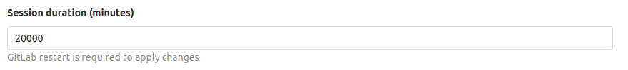

# Instalación de GitLab en tu ordenador

[BACK](../README.md)

## Siguiendo los pasos de GitLab

Instalar y configurar dependencias

```
sudo apt-get update
sudo apt-get install -y curl openssh-server ca-certificates
```
> Nos sugiere instalar postfix, pero si prefieres usar otra configuración para enviar mails no hay problema

```
sudo apt-get install -y postfix
```
Nos aparecerán unas opciones de configuración en la consola, en la que podremos; para este ejemplo, usar Local only

A continuación introducimos el nombre, que puede ser por defecto el de nuestro usuario-máquina.

Y continuará la configuración

Añadimos el paquete de GitLab

```
curl https://packages.gitlab.com/install/repositories/gitlab/gitlab-ee/script.deb.sh | sudo bash
```

A continuación necesitamos saber en qué dirección de GitLab queremos alojar la instancia.
Git se va a encargar de crearla por nosotros.

> Recuerda cambiar la URL de ejemplo
>
> Siempre es mejor que pongáis el nombre de la máquina o la IP.

```
sudo EXTERNAL_URL="https://gitlab.example.com" apt-get install gitlab-ee
```

Vamos a necesitar tener instalado openssh para poder acceder a nuestro servidor.

Y ya tenemos nuestro servidor GitHub listo

##Configuraciones

### Cambiar puerto de acceso

Entramos a la terminal donde esta el server Gitlab y tecleamos lo siguiente:
```
sudo -e /etc/gitlab/gitlab.rb
```
Agregamos el puerto 4444, por ejemplo:
```
external_url 'http://gitlab.example.com:4444'
```
Luego lo guardamos. Volvemos a teclear en la terminal:
```
sudo gitlab-ctl reconfigure
```

### Impedir que usuarios nuevos puedan modificar su identificador

Esto lo tendremos que modificar en un fichero de gitlab

    /etc/gitlab/gitlab.rb

Buscaremos Gitlad user privileges, eliminaremos el # de la segundo opción y la cambiaremos a false, debe quedar así:


### Modificar el tiempo de expiración de la sesión

Esta configuración la modificaremos desde en entorno visual.

Accederemos a `Admin Area -> Settings -> General -> Account and limit ` y modificamos Session duration.



### Gestion por API - token TxinQ17fyGFgD4S8LCDH

Generamos un token desde nuestra configuración de usuario.


Ahora con ese token, podremos acceder por Postman, por ejemplo.

Detallar ejemplos de procesos (vía llamadas a la API) como:

- Alta
    - POST /api/v4/users
    ```json
    {
        "email": "test@test.com",
        "name": "test",
        "password": "testtest",
        "username": "test"
    } 
    ```
- Modificación
    - PUT /api/v4/users/:id
- Borrar
    - DELETE /api/v4/users/:id

<br>

- Bloqueo
    - POST /api/v4/users/:id/block
- Desbloqueo
    - POST /api/v4/users/:id/unblock

<br>

- Establecer usuario como administrador.
    - PUT /api/v4/users/2
    ```json
    {
	    "admin" : true
    }
    ```

<br>

- Creación de proyectos.
    - POST /api/v4/projects
    ```json
    {
        "name" : "testProject"
    }
    ```

<br>


### Personalización

Accederemos a traves de `Admin area -> Appearance`

Realizar labores de customización como por ejemplo: 

* Modificar la página de creación de un nuevo proyecto


* Modificar el logo y la descripción de la pantalla de login.


* Modificar el favicon de gitlab. 


### Importar

Detallar el proceso para poder importar proyectos de GitHub a nuestro
GitLab tanto por pantalla como utilizando la API.

> Entorno visual

Accedemos a NEW PROJECT


Y en la ventana que nos aparece seleccionamos la pestaña de Import projecto


> URL (postman)

* POST /api/v4/projects

```json
{
    "name": "importProject",
    "import_url": "https://github.com/juanlubel/git-flow-nodeJs"
}
```