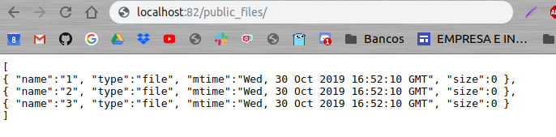
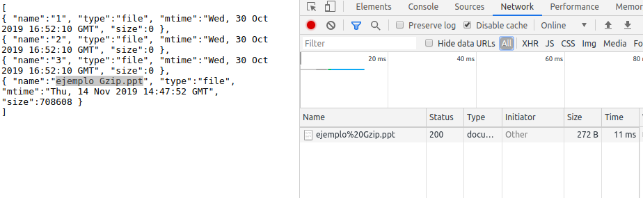
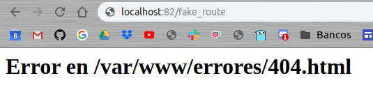
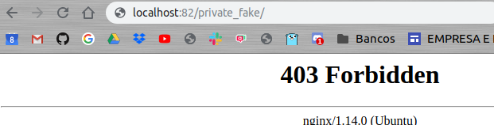
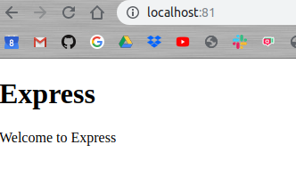
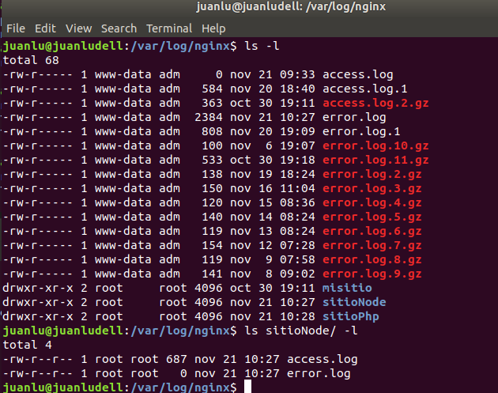
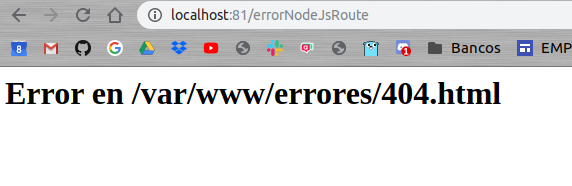

# Servidor apache

[BACK](../README.md)

[ejemplo usado en la guia del servidor NodeJs](https://github.com/juanlubel/git-flow-nodeJs)

## Configurar un servidor PHP

Vamos a crear dentro de nuestro ejemplo sitioPHP nuestro index.php

   cd /var/www/sitioPHP
   nano index.php
  
```php
<?php
   phpinfo()
?>
```

Ahora vamos a habilitar php en nuestro servidor Nginx, pero antes verifica que tienes PHP7.2 instalado
  
   php -v
  
Ahora vamos a configurar nuestro servidor

   sudo nano /etc/nginx/sites-available/sitioPHP
  
Y añadiremos lo siguiente

``` bash
location ~ .php$ {
   include snippets/fastcgi-php.conf;
   fastcgi_pass unix:/run/php/php7.2-fpm.sock;
}
```

Y tendremos que hacer caso a las indicaciones de nginx:

    # Add index.php to the list if you are using PHP
    index index.html index.htm index.nginx-debian.html index.php;

Y añadir index.php para que lo ejecute si no encuentra ninguna de los anteriores.

Para publicar el servidor en el puerto 82 tendremos que poner al inicio del documento de configuración, cuando empiece la directiva server

   listen 82

### Log personalizado

Añadiremos a la configuración las siguientes líneas

   access_log /var/log/nginx/sitioPHP/access.log miformato;
   error_log /var/log/nginx/sitioPHP/error.log;

### Mostrar ficheros en formato JSON

Para poder acceder a los fichero de una ruta en concreto tenemos que decirle a nuestra configuración que lo habilite y que tipo de respuestas queremos, de la siguiente manera:

   location /public_files/{
       autoindex on;
       autoindex_format json;
   }



### Activar la compresión de ficheros

Accederemos a nuestro fichero de configuración en /etc/sitioPHP/

Habilitaremos la compresión GZIP con:.

   gzip on

A continuación configuramos los siguiente parámetros:

   gzip_proxied any;
   gzip_comp_level 7; #recomended
   gzip_min_length 80;
   gzip_types text/css; # text/plain aplication/json

Ahora y después de configurar los autoindexes en una ruta en el ejemplo anterior, /public_files, vamos a comprobar si funciona la compresión.



al ser el fichero mayor de 80 kb, lo ha comprimido pasando de 708608 a 272

### Error en rutas

Vamos a configurar un html por defecto para cuando inserten rutas erróneas o que no existen en nuestro servidor de esta forma:

   error_page 404 /404.html;
   location = /404.html {
           root /var/www/html/errores;
           internal;
   }

por lo tanto:



Antes hemos tenido que crear el directorio ../html/errores y dentro un archivo index.html con el mensaje que podemos ver en la imagen.

### Private folder
 
Vamos a configurar que cuando un directorio empiece por la palabra private nos bloquee el acceso, con la siguiente configuración:

   location /private*/ {
           deny all;
           return 403;
   }



## Configurar servidor NodeJS

Después de crear y configurar un nuevo servidor en el puerto 81.

Añadiremos en la ruta / la siguiente línea

   proxy_pass http://127.0.0.1:3001;

la url es donde estará funcionando nuestro servidor de node.



### Log personalizado

Añadiremos a la configuración las siguientes líneas igual que hicimos en el ejemplo del servidor anterior.

   access_log /var/log/nginx/sitioNode/access.log miformato;
   error_log /var/log/nginx/sitioNode/error.log;

Importante crear el directorio y ya lo tendremos listo.



### Error en rutas

Vamos a configurar un html por defecto para cuando inserten rutas erróneas o que no existen en nuestro servidor de esta forma:

   error_page 404 /404.html;
   location = /404.html {
           root /var/www/html/errores;
           internal;
   }



### Redirecciones

Para la redirecciones debemos configurar el rewrite

   rewrite ^(/documentacion/)(.*)$ http://nodejs.org/en/;
